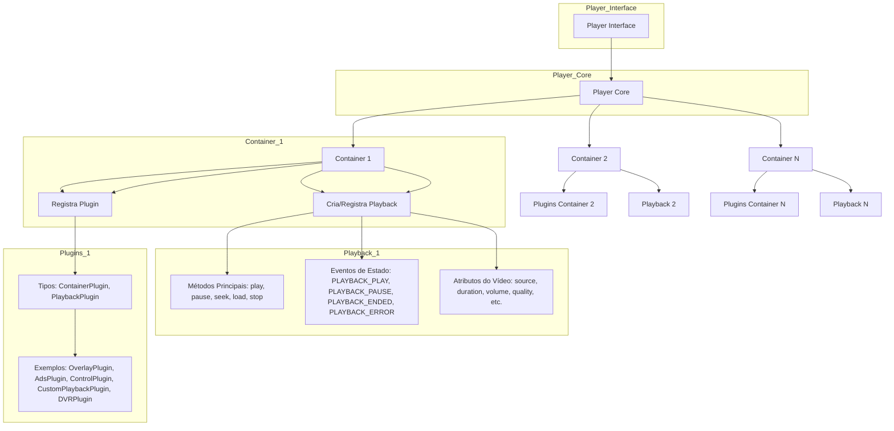
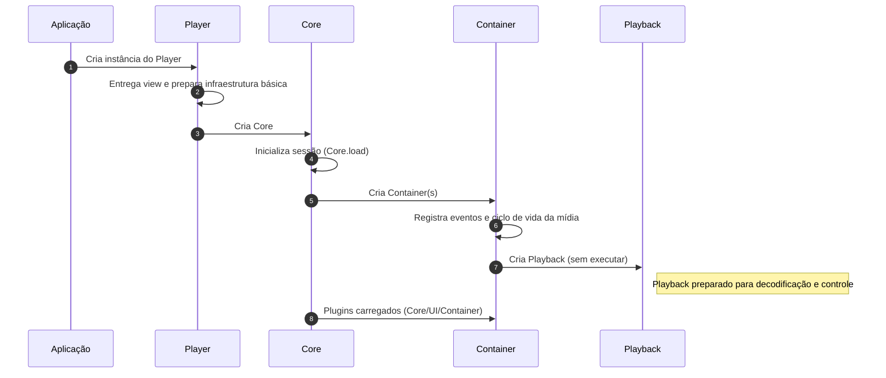
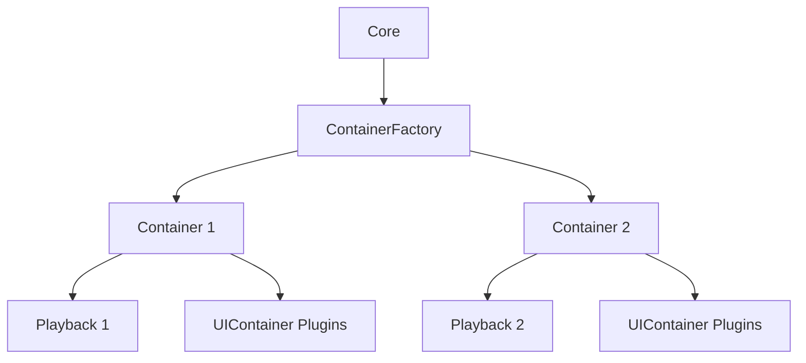
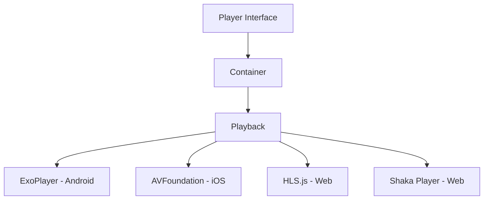
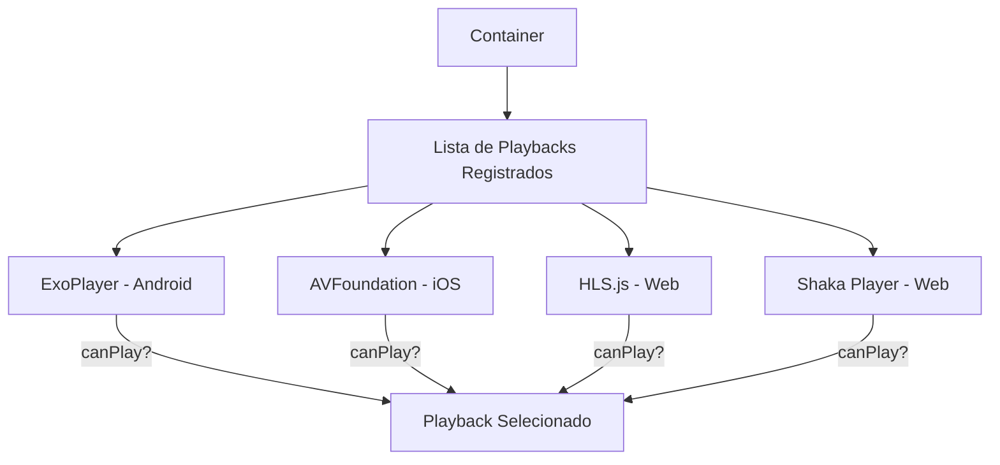
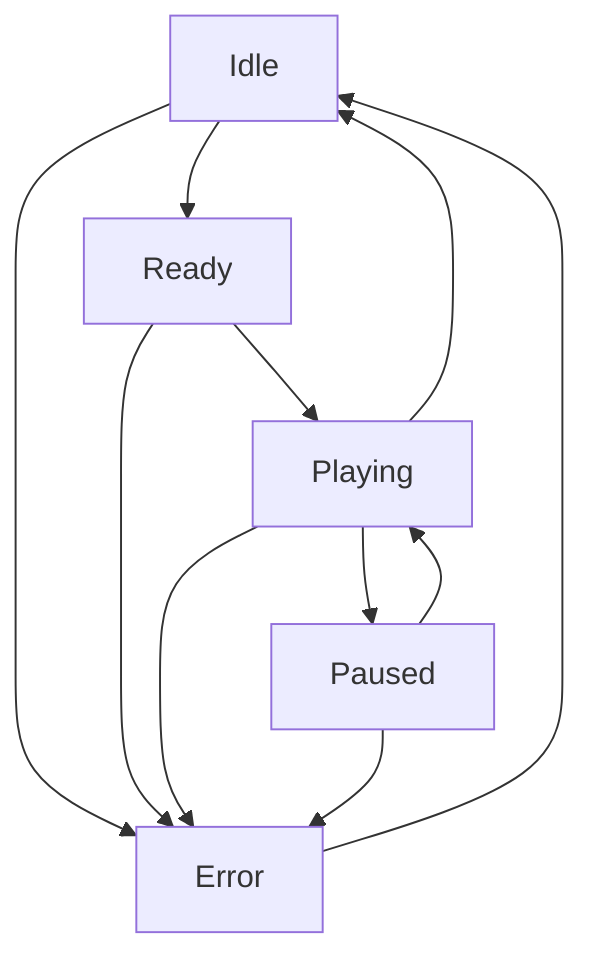
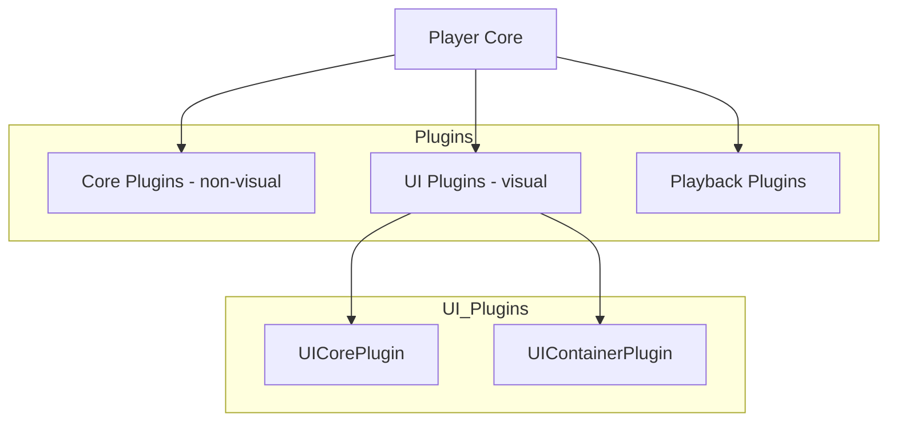
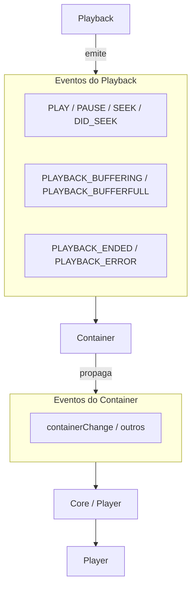
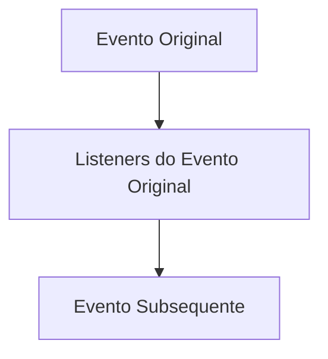
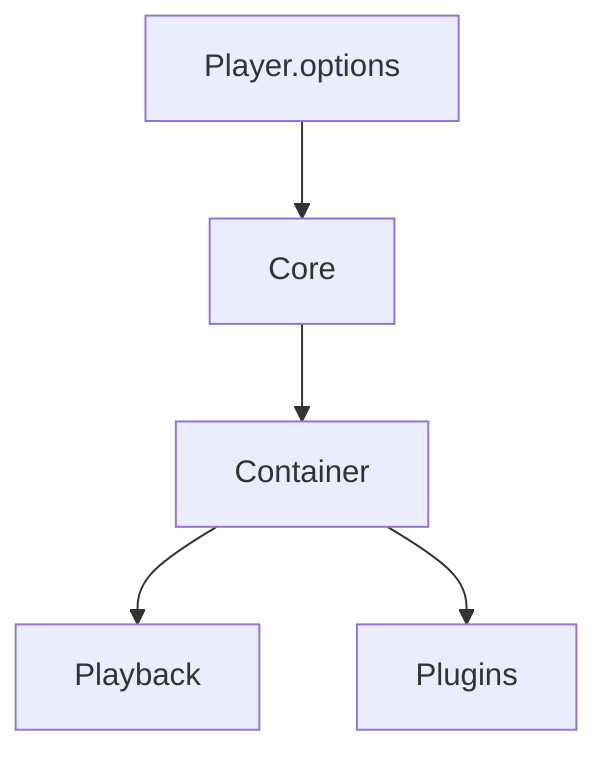

# Projeto de Estudo da Arquitetura do Clappr

Este projeto foi criado para fins de estudo da arquitetura do player Clappr, com foco em compreender como seus componentes, plugins e playbacks interagem. O objetivo é explorar a estrutura, modularidade e padrões usados no Clappr para fins educacionais.

## Descrição do Projeto
- Introdução ao Clappr Player
- Objetivos do Player
  - Objetivos Estratégicos
- Estrutura de Alto Nível / Componentes Principais
  - Descrição Geral
  - Descrição Detalhada por Camada
  - Fluxo de Inicialização do Clappr
  - Containers no Clappr
- Playback
  - Conceito e Abstração
  - Seleção de Playback
  - Comandos Básicos
  - Erros e Fallback
  - Recomendações Gerais
  - Player x Playback
- Máquina de Estados
- Plugins
  - Identificação e Carregamento
  - Categorias de Plugins
- Sistema de Eventos
  - Modelo Publisher-Subscriber
  - Fluxo de Processamento de Eventos
  - Principais Eventos do Playback e Container
- Options no Clappr
  - Principais Options
  - Atualização de Options
- Considerações sobre Concorrência e Threads
- Observações Finais

## **1. Introdução ao Clappr Player**

O **Clappr Player** é um player de vídeo modular e flexível, projetado para funcionar em diversos dispositivos e plataformas, garantindo **compatibilidade, acessibilidade e experiência consistente**.

Ele é estruturado em **camadas** — Player, Core, Container, Playback e Plugins — que permitem isolar cada mídia, controlar eventos e adicionar funcionalidades sem afetar o núcleo do player.

O Clappr também mantém uma **máquina de estados consistente**, coleta **métricas de reprodução e engajamento** e gerencia erros e anúncios de forma confiável.

Nas próximas seções, vamos detalhar cada camada, o fluxo de inicialização, a seleção de playbacks, o uso de plugins e o gerenciamento de eventos, para mostrar como toda a arquitetura funciona na prática.

## **2. Objetivos do Player**

O Clappr Player existe para atender a grandes objetivos estratégicos, garantindo **compatibilidade, extensibilidade, acessibilidade e experiência do usuário**.

### **Objetivos Estratégicos**

- **Compatibilidade**: garantir que os vídeos toquem em múltiplos dispositivos (TV conectada, Android TV, iOS, navegadores etc.), com builds e implementações específicas quando necessário.
- **Arquitetura comum e flexível**: manter uma base compartilhada, permitindo variações por dispositivo para entregar a melhor experiência em cada contexto.
- **Identidade visual**: quando o usuário vê o player, reconhece que é da Globo, independente da plataforma.
- **Extensibilidade por plugins**: possibilitar que outros times adicionem funcionalidades (UI, lógica de negócio, integrações) sem depender do time central do player e sem gerar gargalos.
- **Métricas**: coletar métricas de consumo de vídeo (play, pause, seek, buffering etc.) e métricas de negócio (engajamento, retenção, publicidade), alimentando dashboards e produtos de dados.
- **Acessibilidade**: manter e evoluir o padrão acessível já estabelecido.
- **Abstração da plataforma de vídeos**: encapsula HLS, DASH, session messaging, 60fps etc., fornecendo APIs simples (`play`, `pause`, `seek`).
- **Monetização**: suportar propagandas e anúncios (pre/mid/post-roll, overlay, pause ads).
- **Entrega da melhor experiência de vídeo para cada usuário**, considerando:
    - **Plano** do usuário (conteúdo liberado/restrito)
    - **Dispositivo** (TV, celular, navegador)
    - **Localização** (geoblock, escolha da CDN)
    - **Condição de rede** (adaptação automática da qualidade e resiliência contra falhas)

---

## 3. Estrutura de Alto Nível / Componentes Principais

### **Descrição Geral**

O Clappr Player é estruturado em camadas principais: Player, Core, Container, Playback e Plugins.
Cada camada possui responsabilidades bem definidas, o que garante flexibilidade para extensões, suporte a múltiplos containers e gerenciamento centralizado de eventos.

**Diagrama de Arquitetura**



### **Descrição Detalhada por Camada**

- **Core (@clappr/core)** — é a parte central do player. Gerencia a arquitetura de plugins, o *loader*, o *CoreFactory* e a criação/registro de containers. Concentra a infraestrutura interna do player. É distinto do **Player Instance**, que é apenas a fachada usada pela aplicação.
- **Player (Player Instance / Interface Pública)** — camada utilizada pela aplicação. Fornece métodos públicos (`play`, `pause`, `seek`, `stop`, `load`, `destroy`) e eventos de alto nível (`PLAYER_READY`, `PLAY`, `PAUSE`, `STOP`, `ERROR`). Internamente, delega operações ao **Core** e aos **Containers**.
- **Container** — conecta o **Playback** ao restante do player. Cada container possui exatamente um playback ativo e é responsável por repassar seus eventos para o **Core** e o **Player**. É também o ponto de instalação dos **Container Plugins** e **UI Plugins**, que adicionam comportamentos ou elementos visuais específicos a esse contexto.
- **Playback** — é a abstração de um motor de reprodução (ex.: HTML5 Video, HLS, Shaka, Dash). Implementa métodos principais (`play`, `pause`, `seek`, `stop`, `load`) e emite eventos de estado (`PLAYBACK_PLAY`, `PLAYBACK_PAUSE`, `PLAYBACK_ENDED`, `PLAYBACK_ERROR`, `BUFFERING`, `PROGRESS`, etc.).
- **Plugins** — extensões que adicionam funcionalidades ao player. Podem atuar em diferentes níveis:
    - **Core Plugins**: atuam no escopo global do player, podendo afetar todos os containers.
    - **Container Plugins / UI Plugins**: acoplados a um container específico, manipulam eventos e podem inserir elementos de interface.
    - **Playback Plugins**: ligados diretamente ao playback, estendem ou alteram seu comportamento de reprodução.

<aside>
💡

**Notas sobre Arquitetura**

- Um **CorePlugin** pode instanciar múltiplos containers ou atuar globalmente (por isso é diferente de um ContainerPlugin).
- O fluxo típico de eventos é: **Playback → Container  → Core / Player**.
</aside>

---

### 

- 

### Fluxo de Inicialização do Clappr

O fluxo de inicialização do Clappr prepara Player, Core, Containers e Playback, garantindo que mídia, eventos e plugins estejam prontos antes da reprodução.

Nesta seção, abordamos o processo **até a criação do Playback**, que será detalhado em profundidade nas **próximas seções**.



1. **Instanciação do Player**
    - Cria o Player (`new Clappr.Player({...})`) e entrega uma **view** para a interface.
    - A infraestrutura básica é preparada, mas **nenhum container ou mídia** foi carregado ainda.
2. **Criação do Core**
    - O Player cria o **Core**, responsável por gerenciar containers e eventos globais.
    - Marca o **início da sessão real** (`Core.load`).
3. **Inicialização dos Containers**
    - O Core instancia **Containers**, cada um representando uma mídia ou stream.
    - Cada container cuida do ciclo de vida da mídia e registra seus próprios eventos.
    - Se o container mudar, eventos antigos precisam ser re-registrados.
4. **Criação do Playback (sem execução)**
    - Dentro de cada Container, o **Playback** é criado, mas ainda **não inicia a reprodução**.
    - Ele se prepara para lidar com decodificação, buffering e controle da mídia quando iniciado.
5. **Carregamento de Plugins**
    - Plugins são carregados conforme a configuração.

---

## Containers no Clappr

No Clappr, um **Container** é a unidade que encapsula uma mídia específica dentro do player. Ele gerencia:

- O **Playback** da mídia (decodificação, buffering e controles).
- **Plugins de UI** específicos do conteúdo (UIContainerPlugin).
- **Eventos locais** da mídia (`play`, `pause`, `ended`, etc.).

Fluxo de Criação de Containers e Playbacks no Clappr



### Fluxo de criação do Container

O **Core** utiliza o **ContainerFactory** para criar cada container quando uma nova mídia precisa ser reproduzida. O processo ocorre da seguinte forma:

1. **Core solicita containers** ao `ContainerFactory` para cada fonte de mídia.
2. **Resolve a fonte e tipo MIME** de cada mídia.
3. **Seleciona o Playback** adequado usando `findPlaybackPlugin`.
4. **Cria o Container** e associa o Playback correspondente.
5. **Adiciona plugins de container** e aguarda o evento `CONTAINER_READY` para considerar o container pronto.

### Por que existe

Containers permitem **isolar cada mídia**, garantindo que:

1. Eventos e plugins de um vídeo não afetem outros.
2. Cada container tenha seu **Playback** e UI próprios.
3. O Core permaneça responsável pelo player como um todo, sem lidar diretamente com cada mídia.

<aside>
💡

### Confusão comum

Muitos desenvolvedores confundem **Core e Container**, esperando que o Core gerencie diretamente a reprodução de cada mídia.

Na verdade, o **Core** gerencia o player e seus containers, enquanto cada **Container** gerencia sua própria mídia, eventos e plugins específicos.

📌 **Dica:** pense no container como o **“contexto de cada mídia”**, intermediando o Core e o Playback.

</aside>

---

## **4. Playback**

O **Playback** é a camada responsável pela execução da mídia no Clappr Player. Ele abstrai diferentes tecnologias de reprodução (ExoPlayer, AVFoundation, HLS.js) e mantém uma máquina de estados consistente para todos os playbacks, garantindo **compatibilidade, métricas confiáveis e comportamento previsível**.

### **1. Conceito e Abstração**

**Fluxo de Player, Container e Playback no Clappr**



- Playback é uma **classe abstrata**, implementada por playbacks específicos:
    - Android: **ExoPlayer**
    - iOS: **AVFoundation**
    - Web: **HLS.js**, **Shaka Player**
- Cada playback possui atributos principais:
    - `source` / `mimeType`
    - Posição atual (`time position`)
    - Duração (`duration`)
    - Posição em tempo real (`live`)
    - DVR ativo ou não
    - Volume
    - Faixas de áudio
    - Legendas
    - Qualidade
    - Tipo de mídia (VoD ou Live)
- **Anúncios** (pre/mid/post-roll) são tratados idealmente como outro tipo de mídia.
- Cada playback tem `name/type` único; **não se deve sobrescrever playbacks com o mesmo nome**.
- Playback **emite eventos**, mas **não escuta eventos de outros componentes**.

---

### **2. Seleção de Playback**

O **Container** é responsável por decidir qual implementação de **Playback** será usada para reproduzir a mídia.

Ele mantém uma **lista ordenada de playbacks registrados** e testa cada um com base no método estático `canPlay(source, mimeType)`.

**Fluxo de Seleção de playbacks**



### 

### Como o Player Seleciona o Playback e Garante Compatibilidade

1. O **Container** consulta a lista de playbacks registrados.
2. Para cada playback, é chamado:
    
    ```jsx
    Playback.canPlay(source, mimeType)
    
    ```
    
3. O **primeiro playback que retornar `true`** será utilizado.
4. Caso nenhum playback seja compatível, ocorre **erro de inicialização**.
5. A seleção é baseada no **tipo de arquivo** e no **suporte da plataforma/browser**:
    - Arquivo `MMPD` (DASH) → se suportado, usa **Shaka Player**
    - Arquivo `M3U8` (HLS) → se suportado, usa **HLS.js**
6. Durante a execução, os **eventos externos** dos playbacks (ExoPlayer, HLS.js, Shaka) são **transformados em eventos internos do player**, garantindo consistência em toda a aplicação.

### **Comandos Básicos**

Os métodos do Player, como `play()`, `pause()` e `load()`, retornam `true` se a ação for executada e `false` caso contrário.

| Método | Descrição |
| --- | --- |
| `play()` | Inicia a reprodução |
| `pause()` | Pausa a reprodução |
| `stop()` | Para a reprodução |
| `seek(time)` | Avança ou retrocede para um tempo específico |
| `load(startAt)` | Carrega a mídia (opcional: inicia em `startAt`) |
| `reset()` | Reseta o player |

## **Erros e Fallback**

- **Recuperação de Erros**: Playbacks tentam corrigir erros automaticamente antes de falharem completamente:
    - **Behind Live Window**: Em transmissões ao vivo ou DVR, o Playback pode reiniciar automaticamente.
    - **Erros de Codec**: Problemas com codecs (ex.: Dolby Atmos) podem levar a um recarregamento da mídia.
- **Falha Não Resolvida**: Se o erro persistir:
    - O Playback gera um evento de **erro** e entra no estado `error`.
    - Métodos como `reset()` ou `retry()` podem ser usados para tentar retomar a reprodução antes de abortá-la.
    

### Recomendações Gerais

- **Não sobrescrever playbacks**: cada playback precisa de um `name` único; sobrescrever pode causar conflitos na seleção pelo container e comportamento inesperado.
- **Seguir a máquina de estados**: respeitar os estados (`idle`, `ready`, `playing`, `paused`, `error`) garante que ações e eventos sejam consistentes; o funcionamento detalhado será explicado a seguir.

<aside>
💡

## **Player x Playback**

O **Player** expõe métodos simples e representa o **estado geral** do player.

O **Playback** executa a mídia, gerencia estados detalhados e dispara eventos específicos.

</aside>

---

## **5. Máquina de Estados**

O **Playback** do Clappr controla a reprodução de mídia dentro do container, mantendo **estados internos** para garantir comportamento consistente entre plataformas e permitir coleta confiável de métricas durante toda a reprodução.



- **Estado `ready`**
    - Conteúdo carregado, pronto para reprodução.
    - **Transições:**
        - `play` → inicia reprodução (`playing`).
        - `error` → vai para `error` se ocorrer falha.
- **Estado `playing`**
    - Reprodução em andamento.
    - **Transições:**
        - `pause` → vai para `paused`.
        - `stop / ended` → volta para `idle`.
        - `error` → vai para `error`.
- **Estado inicial (`idle`)**
    - Player sem conteúdo carregado.
    - **Transições:**
        - `load` → passa para `ready` (pronto para reproduzir).
        - `error` → vai para `error` se ocorrer problema antes de carregar.
- **Estado `paused`**
    - Reprodução pausada.
    - **Transições:**
        - `play` → retoma a reprodução (`playing`).
        - `error` → vai para `error`.
- **Estado `error`**
    - Player em estado de erro.
    - **Transições:**
        - `reset` → retorna para `idle`.
        - `load` → vai para `ready` (tentar recarregar conteúdo).
        

---

## 6. Plugins

Os plugins são a principal forma de extender o player sem precisar alterar o núcleo.
Eles permitem adicionar novas funcionalidades, lógicas de negócio e elementos visuais, garantindo que o player seja flexível, customizável e escalável

**Resumo Visual**



### Por que plugins?

- Cada produto pode ter necessidades específicas (ex.: **botão extra**, **overlay**, **integração com analytics**).
- Plugins permitem que **outros times adicionem funcionalidades** sem depender do time central.
- O **Core do player** garante consistência visual e hierarquia correta de camadas.

### **Identificação e Carregamento**

- **Nome único**: todos os plugins e playbacks possuem um `name`.
    - Se um plugin com o mesmo nome já estiver registrado, ele será **sobrescrito**.
    - Isso permite **substituir comportamentos** antes de iniciar o vídeo.
- **Ordem de carregamento**: é **aleatória**.
    - Não é garantido que um plugin seja inicializado antes de outro.
    - Implicação: **não é seguro depender de eventos de plugins específicos**.

### Categorias de Plugins

| Categoria | Classe base | Escopo | Ciclo de vida | Responsabilidades | Exemplos de uso |
| --- | --- | --- | --- | --- | --- |
| **CorePlugin** | `CorePlugin` | Player | **Construção:** criado junto com o **player**.**Destruição:** destruído quando o **player** é destruído.**Containers não afetam.** | - Executar **lógica global** sem interface.- Reagir a eventos do Core.- Implementar métricas, analytics, integrações e ads. | Métricas (QoE, analytics), integrações de negócio, publicidade (`clappr-ima-plugin`) |
| **UICorePlugin** | `UICorePlugin` | Player | **Construção:** criado junto com o **player**.**Destruição:** destruído quando o **player** é destruído.**Containers não afetam.** | - Adicionar **elementos visuais globais**.- Renderizar overlays e telas de erro.- Criar botões e interações aplicáveis ao player inteiro. | Overlays globais, telas de erro, menus e botões de UI globais |
| **UIContainerPlugin** | `UIContainerPlugin` | Container | **Construção:** criado quando um **container** é criado (ex.: ao carregar um vídeo).**Destruição:** destruído quando o **container** é removido (ex.: troca de vídeo). | - Renderizar **controles específicos do container** Exibir informações ligadas à mídia atual (ex.: ads countdown, duração). | Controles de playback, timeline, indicadores de ads (“Seu vídeo começará em 5s”) |
| **PlaybackPlugin** | `Playback` (base) | Container | **Construção:** inicializado junto com o **container**.**Destruição:** destruído quando o **container** é removido (ou o vídeo trocado). | - **Decodificar e reproduzir mídia** (áudio/vídeo).- Controlar buffering, play/pause, seek e eventos de mídia.- Suportar diferentes protocolos (HLS, DASH, MP4 etc.). | **ExoPlayer** (Android), **AVFoundation** (iOS), **HLS.js** (Web), **Shaka Player** (Web) |

---

## 7. Sistema de Eventos no Clappr

O Clappr utiliza um modelo **Publisher-Subscriber**, permitindo que componentes como `Playback`, `Container` e `Core` se comuniquem de forma desacoplada.



### Modelo Publisher-Subscriber

O Clappr utiliza o padrão **Publisher-Subscriber** para gerenciar eventos de forma desacoplada, permitindo que componentes como **Playback**, **Container** e **Core** se comuniquem sem depender diretamente uns dos outros.

modelo **Publisher-Subscriber** do Clappr e exemplos de uso

| Método | Descrição | Exemplo de Uso |
| --- | --- | --- |
| `listenTo` | Registra um callback que será chamado sempre que o evento ocorrer. | `plugin.listenTo(playback, "PLAY", () => console.log("Vídeo iniciado"))` |
| `listenToOnce` | Registra um callback que será chamado **apenas uma vez**. | `plugin.listenToOnce(playback, "PLAY", () => alert("Primeiro play"))` |
| `off` | Remove callbacks previamente registrados para um evento específico. | `plugin.off(playback, "PAUSE")` |
| `stopListening` | Remove **todos os callbacks** registrados para um objeto específico. | `plugin.stopListening(container)` |

### Principais Características dos Eventos no Clappr

| Característica | Descrição |
| --- | --- |
| **Síncronos** | Eventos executam na mesma thread que os disparou, garantindo sequência previsível. |
| **Escopo de escuta** | Ao trocar de container, é necessário reativar listeners para o novo container. |

### Fluxo de Processamento de Eventos no Clappr

O diagrama abaixo ilustra como os eventos e seus listeners são processados no Clappr, mostrando a sequência entre eventos originais e subsequentes.



**Explicação:**

- O evento original dispara todos os listeners registrados.
- O evento subsequente só ocorre **após todos os listeners** do evento original serem executados.
- A ordem entre listeners do mesmo evento **não é garantida**, mas a sequência entre eventos é respeitada.

### Principais Eventos do Playback e Container no Clappr

| Componente | Evento(s) | Descrição / Observações |
| --- | --- | --- |
| **Playback** | `PLAY`, `PAUSE`, `SEEK`, `DID_SEEK` | Controle de reprodução |
|  | `PLAYBACK_BUFFERING`, `PLAYBACK_BUFFERFULL` | Estado do buffer |
|  | `PLAYBACK_ENDED`, `PLAYBACK_ERROR` | Finalização e erros |
| **Container** | `containerChange` | Indica troca de container ativo; listeners devem ser reativados |

### 8. Options no Clappr

O objeto **`options`** configura o Player, Core, Containers e Playback, definindo comportamento, UI, mídias e plugins.

Propagação dentro do Player



- **Player:** recebe todas as opções iniciais.
- **Core:** lê as options e inicializa containers e plugins.
- **Containers:** recebem opções relevantes para cada mídia.
- **Playback e Plugins:** acessam options para comportamento, UI e eventos.

### 

### **Principais Options**

| Opção | Escopo | Descrição |
| --- | --- | --- |
| `source` / `sources` | Container | URL ou lista de fontes de mídia |
| `width` / `height` | Player/Container | Dimensões do player ou container |
| `autoPlay` | Player/Container | Reproduz automaticamente |
| `poster` | Container | Imagem de pré-visualização |
| `corePlugins` | Core | Plugins globais |
| `uiPlugins` | Core/Container | Plugins de interface visual |

### **Atualização de Options**

- Algumas opções podem ser alteradas dinamicamente, mas mudanças em `source` ou `playback` exigem **novo container**.
- Plugins podem ler `player.options` a qualquer momento.
- Exemplo:

```jsx
player.options.autoPlay = false
player.options.width = 800
```

✅ **Resumo:** As options centralizam a configuração do player e são propagadas hierarquicamente, garantindo consistência de comportamento e interface.

## 9. Considerações sobre concorrência e threads

- Todo código do player é executado na **mesma thread** (JavaScript ou Android/iOS), evitando concorrência entre plugins.
- **Exceção:** eventos gerados por **componentes externos**, que podem vir de threads diferentes.
    - Ex.: erro do EXO Player pode ocorrer em thread separada de timers internos do player.


## Funcionalidades
- [x] Registro e gerenciamento de plugins
- [x] Registro e seleção dinâmica de playbacks
- [x] Eventos básicos para controle de mídia (play, pause)
- [x] Estrutura organizada em módulos TypeScript
- [ ] Separação clara entre lógica e interface (view)

## Tarefas pendentes
- [ ] Separar claramente a view dos componentes
- [ ] Implementar playbacks reais (HTML5, Shaka, HLS)

## Como usar
- [x] Clone este repositório
- [x] Instale dependências (se houver)
- [x] Explore o código-fonte para entender a arquitetura
- [x] Execute exemplos ou testes para ver o player em ação


