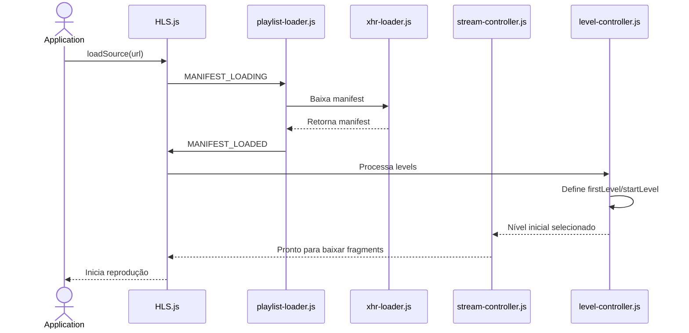
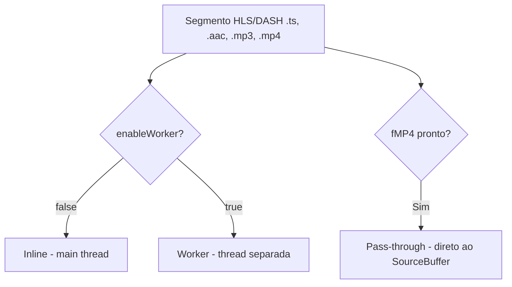
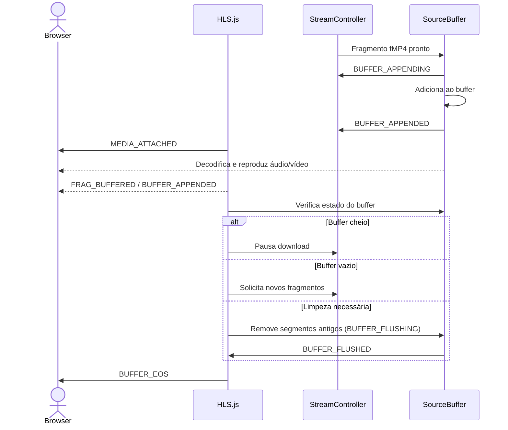

# HLS.js Playback – Introdução

## Índice
- [Introdução](#hlsjs-playback--introdução)
- [Fluxo do Manifest](#fluxo-do-manifest)
- [Transmuxing, Demuxing e Remuxing com Web Workers](#transmuxing-demuxing-e-remuxing-com-web-workers)
- [Processamento do Buffer](#processamento-do-buffer)
- [Eventos do Buffer](#eventos-do-buffer)
- [Exemplos de Código](#exemplos-de-código)
- [Configurações de Buffer](#configurações-de-buffer)
- [Eventos de Erro do Buffer](#eventos-de-erro-do-buffer)
- [Considerações Técnicas](#considerações-técnicas)
- [Eventos Relevantes no Player](#eventos-relevantes-no-player)
- [Referências](#referências)

O HLS.js é uma implementação JavaScript do protocolo HTTP Live Streaming (HLS), usada para reprodução adaptativa de vídeo em navegadores que não suportam HLS nativamente. No Clappr, a integração ocorre via o plugin @clappr/hlsjs-playback, que utiliza o HLS.js para decodificar e reproduzir fluxos HLS com opções configuráveis.

---

## Fluxo do Manifest

O método `hls.loadSource(url)` inicia o carregamento do manifest. O evento `MANIFEST_LOADING` é disparado, e o `playlist-loader.js` usa o `xhr-loader.js` para baixar o manifest. Após o download, o evento `MANIFEST_LOADED` é emitido. O `stream-controller.js` coordena o fluxo de reprodução, enquanto o `level-controller.js` interpreta o master manifest e constrói a lista de levels disponíveis (diferentes qualidades do vídeo).

Exemplo de Master Manifest:

```
#EXTM3U
#EXT-X-VERSION:3
#EXT-X-STREAM-INF:BANDWIDTH=1400000,RESOLUTION=1280x720
mid/playlist.m3u8
#EXT-X-STREAM-INF:BANDWIDTH=800000,RESOLUTION=640x360
low/playlist.m3u8
#EXT-X-STREAM-INF:BANDWIDTH=2800000,RESOLUTION=1920x1080
high/playlist.m3u8
```

Após o parsing, o HLS.js cria internamente a lista de levels:

```js
const levels = [
  { index: 0, bandwidth: 1400000, resolution: "1280x720", url: "mid/playlist.m3u8" },
  { index: 1, bandwidth: 800000, resolution: "640x360", url: "low/playlist.m3u8" },
  { index: 2, bandwidth: 2800000, resolution: "1920x1080", url: "high/playlist.m3u8" }
];
```

A escolha do nível inicial ocorre via `startLevel` (manual) ou `firstLevel` (automático, padrão: primeiro da lista).



---

## Transmuxing, Demuxing e Remuxing com Web Workers

O HLS.js realiza transmuxing, reempacotando segmentos MPEG-TS (.ts) em fMP4 fragmentado (CMAF) sem reencode. O pipeline envolve:
- **Demuxing**: extrai streams elementares de vídeo, áudio e metadados.
- **Remuxing**: reempacota essas streams em fMP4, pronto para o SourceBuffer.

O uso de Web Workers permite executar esse processamento em threads separadas, mantendo a UI responsiva e melhorando o desempenho em streams pesados ou dispositivos de baixa potência.



### Modos de Execução
- **Inline**: thread principal, simples de debugar, pesado em streams grandes.
- **Worker**: thread separada, libera a main thread, ideal para streams pesados.
- **Pass-through**: segmentos fMP4 já prontos são enviados direto ao SourceBuffer.
- **Multi-tracks**: cada track (vídeo, áudio, legenda) é processada individualmente, permitindo switching dinâmico.

### Arquivos do Pipeline
- **Transmuxer**: `transmuxer.ts`, `transmuxer-worker.ts`
- **Demuxers**: `tsdemuxer.ts`, `aacdemuxer.ts`, `mp3demuxer.ts`, `mp4demuxer.ts`, `demuxer-inline.ts`
- **Remuxers**: `mp4-remuxer.ts`, `passthrough-remuxer.ts`, `mp4-tools.ts`

### Benefícios
- Mantém a UI responsiva
- Melhor utilização de múltiplos núcleos de CPU
- Reduz quedas de frames em streams pesados

---

## Processamento do Buffer

O buffer atua como intermediário entre o download dos fragmentos de mídia e a reprodução no navegador. Usando o MSE, os segmentos recebidos em MPEG-TS são transmuxados para fMP4 e adicionados ao SourceBuffer, garantindo:
- Reprodução contínua e estável
- Sincronização entre áudio e vídeo
- Controle de memória e latência



### Eventos do Buffer
- `BUFFER_CREATED`: SourceBuffer criado
- `BUFFER_APPENDING`: segmento pronto para ser adicionado
- `BUFFER_APPENDED`: segmento adicionado
- `BUFFER_FLUSHING`: início da remoção de segmentos antigos
- `BUFFER_FLUSHED`: limpeza concluída
- `BUFFER_EOS`: fim do stream
- `BUFFER_CODECS`: codecs conhecidos
- `BUFFER_RESET`: buffer reiniciado

### Exemplos de Código

```js
hls.on(Hls.Events.BUFFER_APPENDING, (event, data) => {
  console.log('Segmento prestes a ser adicionado:', data.type);
});
hls.on(Hls.Events.BUFFER_APPENDED, (event, data) => {
  console.log('Segmento adicionado com sucesso:', data.type);
});

setInterval(() => {
  const buffered = video.buffered;
  if (buffered.length > 0) {
    const bufferEnd = buffered.end(buffered.length - 1);
    const bufferLength = bufferEnd - video.currentTime;
    console.log(`Tempo de buffer: ${bufferLength.toFixed(2)}s`);
  }
}, 1000);
```

### Configurações de Buffer

```js
const hls = new Hls({
  liveBackBufferLength: 30,          // segundos de back-buffer em live
  maxBufferLength: 60,               // tempo máximo do buffer em segundos
  maxBufferSize: 100 * 1024 * 1024,  // tamanho máximo do buffer em bytes
  enableWorker: true,                // transmuxing em Web Worker
});
```

- `liveBackBufferLength`: controla baixa latência em transmissões ao vivo
- `maxBufferLength`: limita tempo máximo de conteúdo armazenado
- `maxBufferSize`: limita memória usada pelo buffer
- `enableWorker`: mantém UI responsiva usando Web Worker para transmuxing

### Eventos de Erro do Buffer

| Evento                 | Descrição                                      | Causa comum                | Estratégia de recuperação |
|------------------------|------------------------------------------------|----------------------------|--------------------------|
| BUFFER_APPEND_ERROR    | Erro ao adicionar dados ao buffer de mídia     | Falta de memória, erro de transmuxing, fragmento corrompido | Reinserir segmento ou reiniciar buffer |
| BUFFER_STALLED_ERROR   | Reprodução interrompida por falta de dados     | Segmentos não chegam a tempo, rede lenta | Solicitar novos fragmentos, reduzir qualidade |
| BUFFER_FULL_ERROR      | Buffer atingiu o limite máximo                 | Configurações altas, memória limitada | Ajustar maxBufferLength ou maxBufferSize |
| BUFFER_APPENDING_ERROR | Falha ao tentar adicionar fragmento ao buffer | Problemas na decodificação ou incompatibilidade de codec | Verificar transmuxing e compatibilidade de codecs |
| BUFFER_ADD_CODEC_ERROR | Falha ao adicionar um novo codec ao SourceBuffer | MIME type ou codec não suportado | Garantir compatibilidade de codecs e formatos |
| BUFFER_NUDGE_ON_STALL  | Navegador "preso" no buffer                   | Desempenho do navegador ou inconsistência no currentTime | Forçar avanço do currentTime ou limpar buffer |

---

## Considerações Técnicas

- Cada pacote TS = 188 bytes fixos (Sync Byte, Header, Payload)
- Codecs suportados: AAC, H.264, H.265/HEVC, MP3 (limitado)
- Sincronização A/V ajustada via PTS/DTS no mp4-remuxer.ts
- ABR (Adaptive Bitrate): troca de qualidade transparente
- Workers (transmuxer-worker.ts): processamento em paralelo
- Passthrough: se já vem em fMP4 (CMAF), não precisa transmux

---

## Eventos Relevantes no Player

| Evento           | Função no fluxo | Método no HlsjsPlaybackTVs.js |
|------------------|-----------------|-------------------------------|
| MEDIA_ATTACHED   | Vincula elemento de mídia | onMediaAttached() |
| MANIFEST_PARSED  | Manifest analisado, gera lista de levels | onManifestParsed() |
| LEVEL_LOADED     | Playlist de nível carregada | onLevelLoaded() |
| FRAG_LOADING     | Início do download de fragmentos | onFragLoading() |
| FRAG_LOADED      | Fragmento carregado | onFragLoaded() |
| BUFFER_APPENDING | Antes de adicionar ao buffer | onBufferAppending() |
| BUFFER_APPENDED  | Após adicionar ao buffer | onBufferAppended() |

---

## Referências
- [HLS.js README – GitHub](https://github.com/video-dev/hls.js)
- [MDN Web Docs – Using Web Workers](https://developer.mozilla.org/en-US/docs/Web/API/Web_Workers_API/Using_web_workers)

---

Esta documentação apresenta o funcionamento do HLS.js Playback, seu fluxo de manifest, processamento de transmuxing, gerenciamento de buffer e eventos relevantes, conforme utilizado na arquitetura do Clappr.
